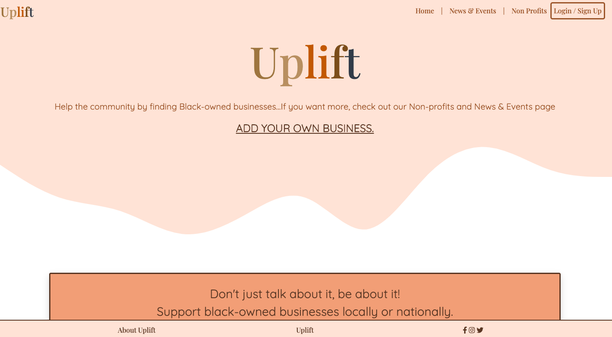

# Project-2-Change

## Description 

Uplift is a command-line-interface (CLI) application that aims to support Black-owned businesses. The user can search for black-owned businesses in their   
vicinity/ neighborhood or anywhere else. The application is intended to be a resource for business owners as well as consumers who are searching to support
this community. The visitor to the website can make an account and add a business. 

This project has given us the opportunity to learn about continuous integration services, like Travis CI, MVC (model,view, controller) organizational tool, as well as 
using handlebars. 

Through our application, we want to continue the conversaton about civil rights. It was created at the time of the 2020 protests against police brutality and was inpsired by the changes made by those who were speaking up and standing up for Black communities. We recognized 
that the movement extends far beyond police brutality and encompasses decades of racial injustices and we want a continual resource 
for the Black communitities and their allies to use as a tool of betterment.

## Table of Contents

* [General-Technologies](#general-technologies)
* [Packages](#packages)
* [APIs](#apis)
* [Demonstration](#demonstration)
* [Application](#Application)
* [Installation](#installation)
* [Future-Direction](#future-direction)
* [Test](#test)
* [Acknowledgements](#acknowledgements)
* [Questions](#questions)

## General-Technologies
* JavaScript
* Jquery
* Bootstrap
* Node.js
* MySQL and MySQL Workbench
* npm
* Travis CI 
* ES Lint 
* Heroku
* SociableKit 
* Puppeteer

## Packages
* ajax 
* axios 
* bcryptjs  
* dotenv
* express 
* express-handlebars 
* express-session
* handlebars
* mysql2
* newsapi
* node
* nodemon
* passport
* passport-local

## APIs
* NewsAPI
* CharityAPI

## Demonstration 

* [Application Link](https://project-uplift.herokuapp.com/)

## Application 

* [Product Pitch](https://docs.google.com/presentation/d/15Ta0yO-wjAurrKLhnWCmK_xgZ9Tl3LYatU0oFLu6ACQ/edit?usp=sharing)
* [Product Brainstrorm Document](https://docs.google.com/document/d/19GbVyL6Xn9Fp5ne9Gotu0isAwqOV008TIHnhYGSOKJ0/edit)

## Installation

The following installations are needed for this package:
1. npm init  
2. npm install listed dependencies
    
Once in the correct directory (server.js), run "node server.js"

## Future Direction 

We intend to exapnd the database of the application as well as add more of the following features/ technologies:
 *  Maps API 
 *  Set Up a Donation Page 
 *  Create a username isntead of the email 
 *  Scaling the application 

## Test

* Coming soon.

## Acknowledgements

* UW Coding Bootcamp instructional team and classmates
* [Inquirer documentation](https://www.npmjs.com/package/inquirer)
* [Mysql documentation](https://www.npmjs.com/package/mysql)
* Figma - wireframe design 

## Questions 

If you have any questions, please contact us on:
GitHub at [avaarm](https://github.com/avaarm)
Email at [Armenuhi](mailto:avaarm95@mail.com)

